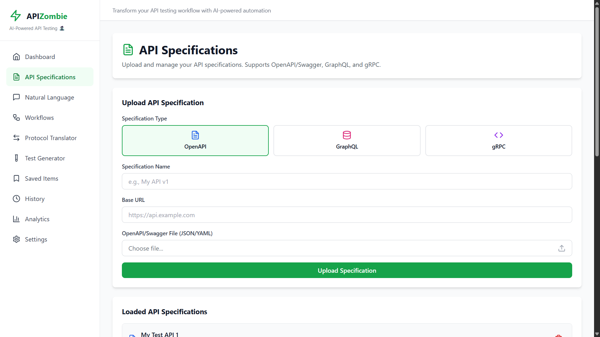
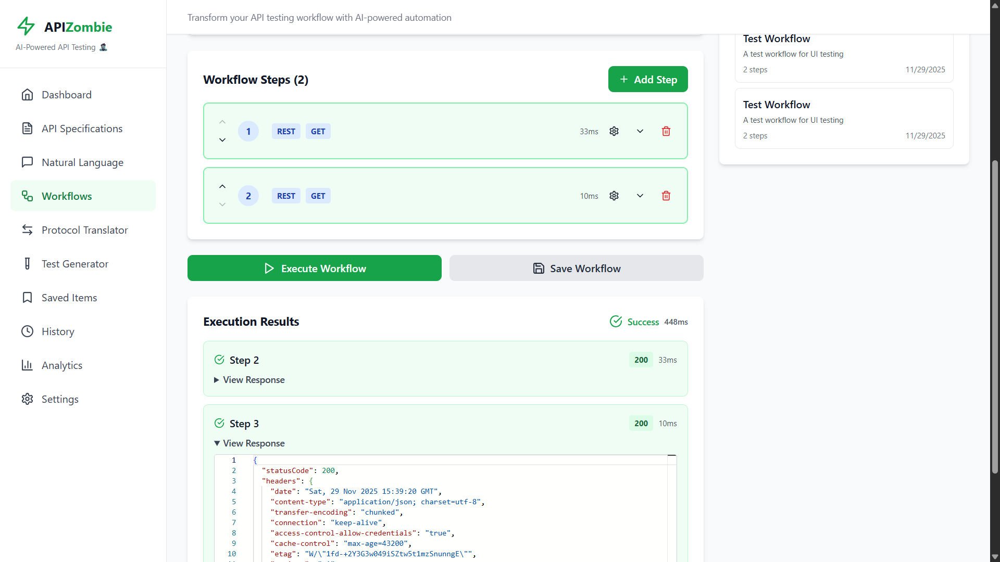
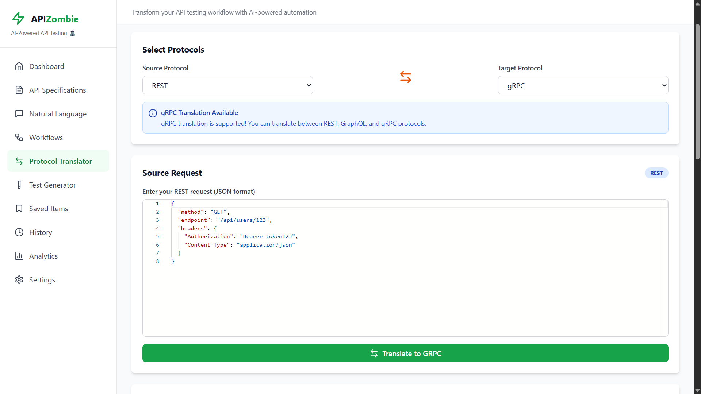
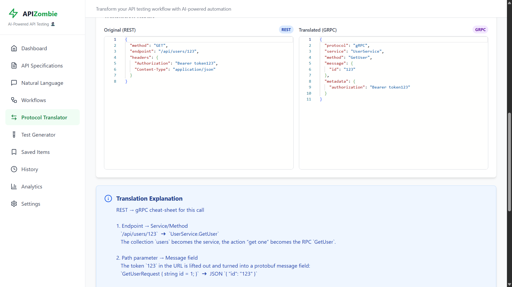
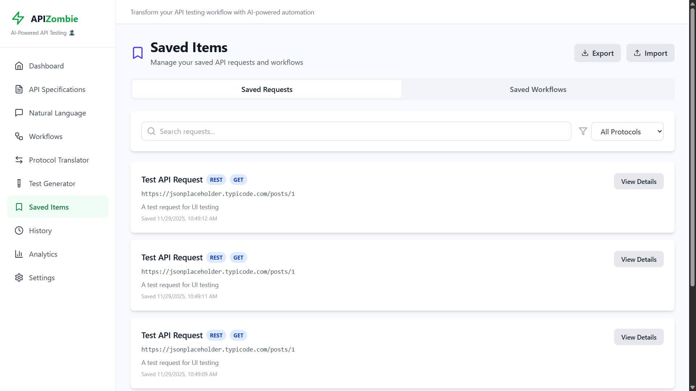
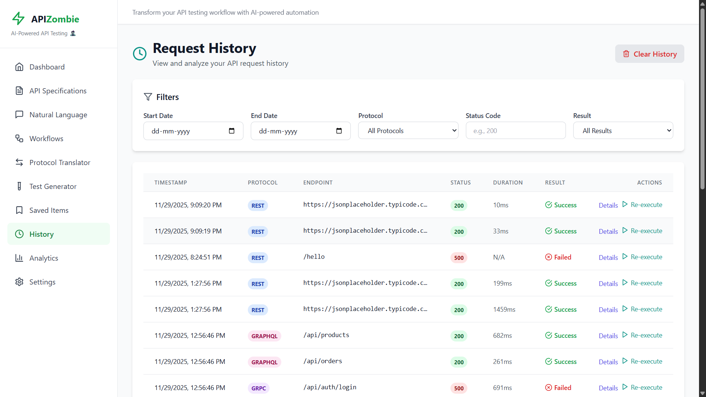
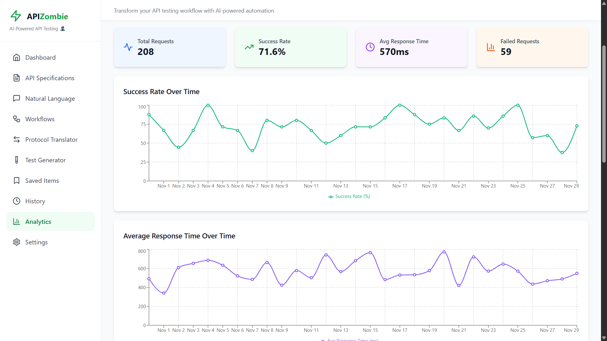
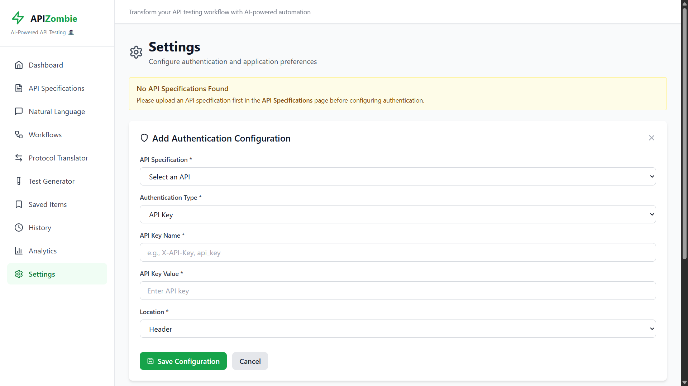
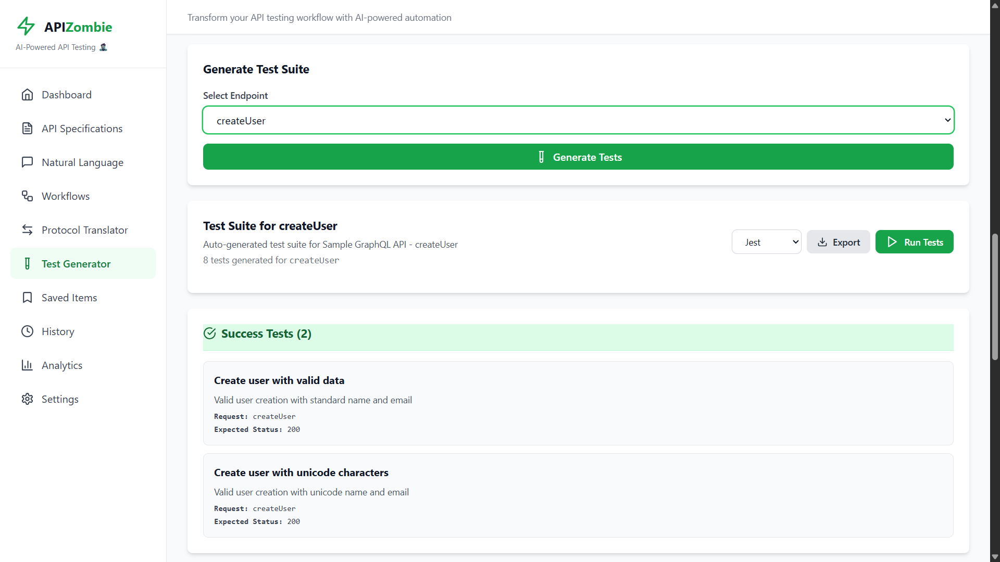

# 🧟 APIZombie

**The Frankenstein API Testing Monster** - An AI-powered platform that brings together REST, GraphQL, and gRPC APIs into one unified testing experience.

[](https://kiroween-api-zombie-1tj4.vercel.app/)
[](https://github.com/Shripad735/Kiroween-APIZombie)
[](LICENSE)

---

## 🎯 What is APIZombie?

APIZombie is an AI-powered API testing platform that solves the complexity of working with multiple API protocols. Instead of juggling between different tools for REST, GraphQL, and gRPC, APIZombie brings everything together in one intuitive interface.

### 🔥 Live Demo
**Try it now:** [https://kiroween-api-zombie-1tj4.vercel.app/](https://kiroween-api-zombie-1tj4.vercel.app/)

---

## 💡 The Problem It Solves

Modern applications use multiple API protocols, and developers face several challenges:

### 1. **Tool Fragmentation**
- Different tools for REST (Postman), GraphQL (GraphiQL), and gRPC (BloomRPC)
- Context switching between multiple applications
- Inconsistent interfaces and workflows

### 2. **Manual Test Creation**
- Writing test cases is time-consuming
- Maintaining test suites across protocols is tedious
- Ensuring comprehensive coverage requires significant effort

### 3. **Protocol Translation**
- Understanding how to convert between REST and GraphQL is complex
- No easy way to see equivalent requests across protocols
- Learning curve for each protocol

### 4. **Complex Workflows**
- Testing multi-step API flows requires custom scripting
- Passing data between different protocol calls is challenging
- No visual way to build and manage workflows

### 5. **Natural Language Barrier**
- Remembering exact API syntax and parameters
- Writing requests from scratch every time
- No intelligent assistance for API exploration

---

## ✨ How APIZombie Solves These Problems

APIZombie provides a unified platform with AI-powered features that make API testing effortless:

### 🤖 **Natural Language to API**
Describe what you want in plain English, and AI generates the exact API request for you.

**Example:** "Get all users from the API" → Generates complete REST/GraphQL/gRPC request

### 🔄 **Multi-Protocol Support**
Test REST, GraphQL, and gRPC APIs in one place without switching tools.

### 🧪 **AI-Powered Test Generation**
Automatically generate comprehensive test suites including success cases, error cases, edge cases, and security tests.

### 🔀 **Protocol Translation**
Convert API requests between REST, GraphQL, and gRPC with AI-powered explanations.

### 🔗 **Visual Workflow Builder**
Chain multiple API calls together across different protocols with drag-and-drop simplicity.

### 📊 **Analytics & Insights**
Track API performance, success rates, and usage patterns with interactive dashboards.

### 🔐 **Secure Authentication**
Manage API keys, Bearer tokens, OAuth, and other authentication methods with encrypted storage.

---

## 🖼️ Screenshots

### Main Dashboard
The central hub for accessing all features with quick start guidance.


---

### API Specifications
Upload and manage OpenAPI, GraphQL schemas, and gRPC proto files in one place.



---

### Natural Language Interface
Describe API requests in plain English and let AI generate them for you.


---

### Workflow Builder
Create complex multi-step API workflows with visual drag-and-drop interface.



---

### Protocol Translator
Convert API requests between REST, GraphQL, and gRPC with AI explanations.





---

### Saved Items
Organize and manage your saved API requests and workflows.



---

### Request History
Track all your API requests with filtering and re-execution capabilities.



---

### Analytics Dashboard
Visualize API performance metrics with interactive charts.



---

### Settings
Configure authentication and manage application preferences.



---

### Test Generator
Automatically generate comprehensive test suites for your APIs.



---

## 🚀 Key Features

### 🎯 **Core Capabilities**
- **Natural Language Processing**: Convert plain English to API requests
- **Multi-Protocol Support**: REST, GraphQL, and gRPC in one platform
- **AI Test Generation**: Automatically create comprehensive test suites
- **Protocol Translation**: Convert between different API formats
- **Workflow Automation**: Chain multiple API calls together
- **Request History**: Track and re-execute previous requests

### 📊 **Analytics & Monitoring**
- Success rate tracking
- Response time analysis
- Most-used endpoints
- Protocol usage breakdown
- Interactive charts and visualizations

### 🔐 **Security & Authentication**
- API Key management
- Bearer Token support
- Basic Authentication
- OAuth 2.0 integration
- AES-256 encrypted credential storage
- Secure session management

### 💾 **Data Management**
- Save and organize requests
- Export/Import workflows
- Search and filter capabilities
- Tag-based organization
- Shareable configurations

### 🎨 **User Experience**
- Responsive design (desktop, tablet, mobile)
- Dark mode support
- Intuitive navigation
- Real-time feedback
- Monaco code editor integration

---

## 🛠️ Tech Stack

### Frontend
- **React 18** - Modern UI framework
- **Vite** - Lightning-fast build tool
- **Tailwind CSS** - Utility-first styling
- **React Router** - Client-side routing
- **React Query** - Data fetching and caching
- **Monaco Editor** - Code editing experience
- **Recharts** - Interactive data visualization
- **Lucide React** - Beautiful icons

### Backend
- **Node.js + Express** - Server framework
- **MongoDB + Mongoose** - Database and ODM
- **Groq AI** - LLM for natural language processing
- **Axios** - HTTP client
- **Winston** - Logging
- **Helmet** - Security headers
- **Express Rate Limit** - API protection

### Infrastructure
- **Vercel** - Serverless deployment
- **MongoDB Atlas** - Cloud database
- **Groq API** - AI processing

---

## 📦 Installation

### Prerequisites
- Node.js 18+ installed
- MongoDB Atlas account (free tier available)
- Groq API key (free at [console.groq.com](https://console.groq.com))

### Quick Start

1. **Clone the repository**
```bash
git clone https://github.com/Shripad735/Kiroween-APIZombie.git
cd Kiroween-APIZombie
```

2. **Backend Setup**
```bash
cd backend
npm install

# Configure environment variables
cp .env.example .env
# Edit .env and add your MONGODB_URI and GROQ_API_KEY

# Start backend server
npm start
```

3. **Frontend Setup**
```bash
cd frontend
npm install

# Start development server
npm run dev
```

4. **Access the application**
- Frontend: `http://localhost:3000`
- Backend: `http://localhost:5000`

---

## 🎯 How to Use

### 1. Upload API Specification
- Go to **API Specifications** page
- Upload your OpenAPI/Swagger file, GraphQL schema, or gRPC proto file
- The system will parse and display all available endpoints

### 2. Test with Natural Language
- Navigate to **Natural Language** page
- Describe what you want to test in plain English
- Example: "Get all users with role admin"
- AI generates the complete API request
- Click **Execute** to run the request

### 3. Build Workflows
- Go to **Workflows** page
- Click **Add Step** to add API calls
- Configure data passing between steps
- Execute the entire workflow with one click

### 4. Generate Tests
- Visit **Test Generator** page
- Select an endpoint from your API spec
- Click **Generate Tests**
- AI creates comprehensive test suite
- Export tests in Jest or Postman format

### 5. Translate Protocols
- Open **Protocol Translator** page
- Paste your REST request
- Select target protocol (GraphQL or gRPC)
- Get translated request with explanation

---

## 🌟 Use Cases

### For Developers
- **Rapid API Exploration**: Quickly test new APIs without reading extensive documentation
- **Protocol Learning**: Understand how different protocols work by seeing translations
- **Workflow Testing**: Test complex multi-step user journeys
- **Documentation**: Generate test cases that serve as API documentation

### For QA Engineers
- **Automated Testing**: Generate comprehensive test suites automatically
- **Cross-Protocol Testing**: Test APIs across different protocols in one place
- **Regression Testing**: Save and re-run test workflows
- **Performance Monitoring**: Track API response times and success rates

### For API Designers
- **Protocol Comparison**: See how your API would look in different protocols
- **Test Coverage**: Ensure all endpoints have proper test coverage
- **Error Handling**: Test error scenarios automatically
- **Security Testing**: Generate security-focused test cases

---

## 🔐 Security Features

APIZombie implements enterprise-grade security:

- **Input Sanitization**: Protection against XSS and injection attacks
- **Rate Limiting**: Prevent API abuse and DDoS attempts
- **CORS Protection**: Secure cross-origin resource sharing
- **Credential Encryption**: AES-256 encryption for stored credentials
- **Security Headers**: Comprehensive HTTP security headers via Helmet.js
- **Request Size Limits**: Protection against large payload attacks

---

## 📚 Documentation

- **[Deployment Guide](DEPLOYMENT.md)** - Deploy to production
- **[Environment Variables](ENVIRONMENT_VARIABLES.md)** - Configuration reference
- **[Troubleshooting](DEPLOYMENT_TROUBLESHOOTING.md)** - Common issues and solutions

---

## 🗺️ Roadmap

### Current Status
✅ Core features implemented and production-ready
✅ Multi-protocol support (REST, GraphQL, gRPC)
✅ AI-powered natural language processing
✅ Workflow builder and automation
✅ Test generation and execution
✅ Analytics and monitoring
✅ Deployed and live

### Future Enhancements
- [ ] Collaborative features (team workspaces)
- [ ] API mocking capabilities
- [ ] Performance testing tools
- [ ] CI/CD integration
- [ ] Custom plugin system
- [ ] Advanced analytics and reporting
- [ ] WebSocket support
- [ ] API versioning management

---

## 🤝 Contributing

Contributions are welcome! This is an open-source project.

1. Fork the repository
2. Create your feature branch (`git checkout -b feature/AmazingFeature`)
3. Commit your changes (`git commit -m 'Add some AmazingFeature'`)
4. Push to the branch (`git push origin feature/AmazingFeature`)
5. Open a Pull Request

---

## 📄 License

This project is licensed under the MIT License - see the [LICENSE](LICENSE) file for details.

---

## 🙏 Acknowledgments

- **Groq** - For providing the amazing LLM API
- **MongoDB Atlas** - For reliable cloud database hosting
- **Vercel** - For seamless serverless deployment
- **Open Source Community** - For the incredible tools and libraries

---

## 📞 Contact & Links

- **Live Demo**: [https://kiroween-api-zombie-1tj4.vercel.app/](https://kiroween-api-zombie-1tj4.vercel.app/)
- **GitHub**: [https://github.com/Shripad735/Kiroween-APIZombie](https://github.com/Shripad735/Kiroween-APIZombie)
- **Author**: Shripad SK

---

<div align="center">

**Built with ❤️ by Shripad SK**

⭐ Star this repo if you find it useful!

</div>
